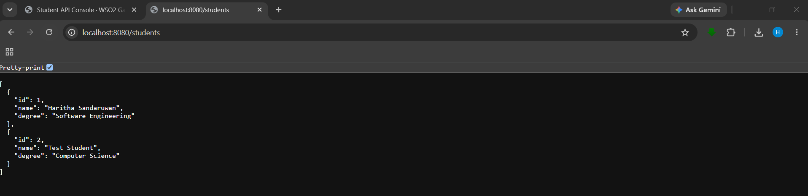
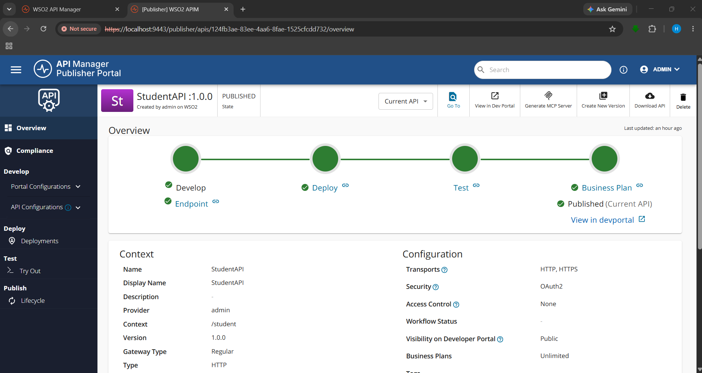
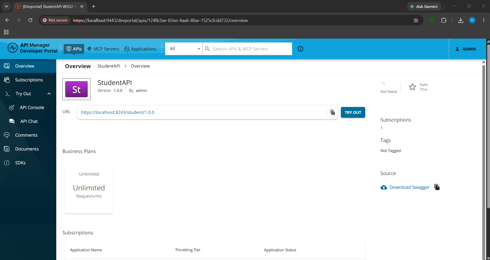
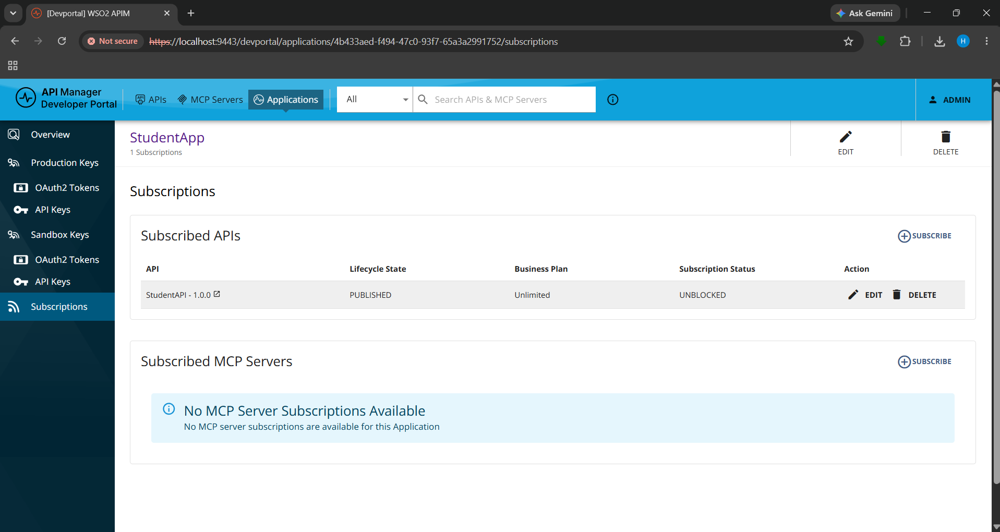
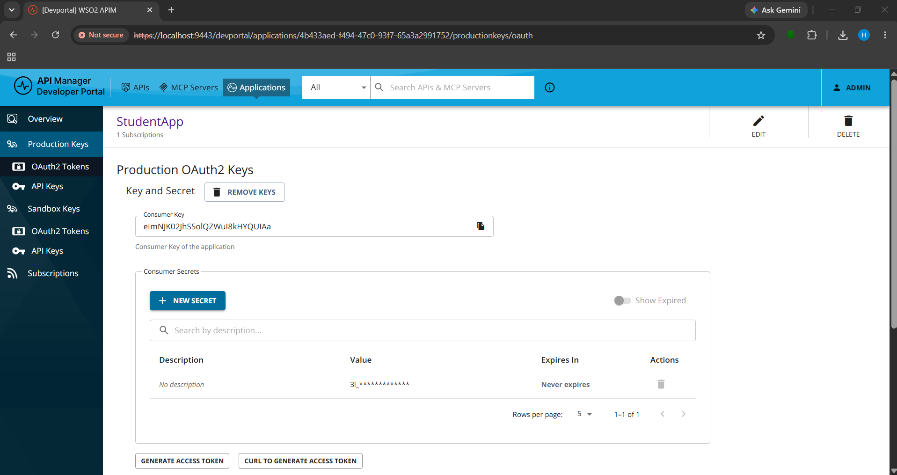
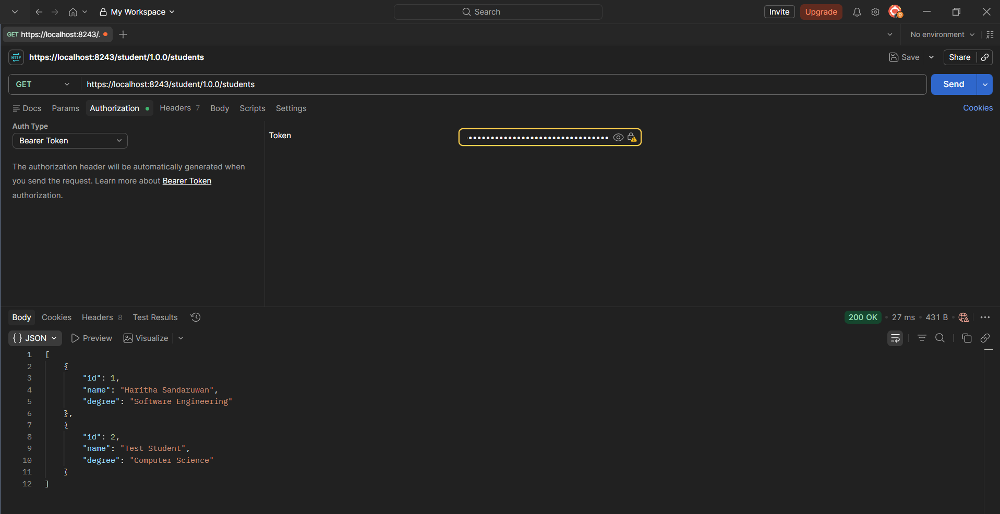
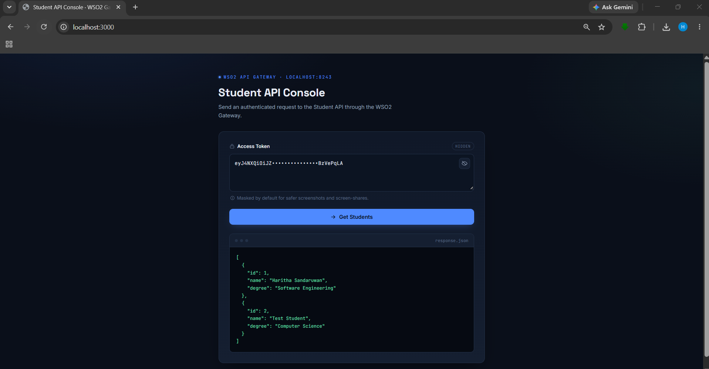

# WSO2 Student API Management Demo

This project demonstrates how a simple **Node.js Student REST API** can be published, secured, subscribed to, and invoked through **WSO2 API Manager**.

The project includes:

- A Node.js backend API
- WSO2 API Manager Publisher Portal configuration
- WSO2 Developer Portal subscription
- OAuth2 access token-based API invocation
- Postman API testing
- A simple frontend demo that calls the API through the WSO2 Gateway

---

## Project Flow

```text
Frontend App → WSO2 API Gateway → Node.js Backend API
```

The backend API runs locally on port `8080`, and WSO2 API Manager exposes it through the Gateway on port `8243`.

---

## Technologies Used

- Node.js
- Express.js
- HTML
- CSS
- JavaScript
- WSO2 API Manager 4.7.0
- WSO2 Publisher Portal
- WSO2 Developer Portal
- OAuth2 Access Token
- Postman
- GitHub

---

## Project Structure

```text
wso2-student-api-management-demo/
│
├── student-api/
│   ├── server.js
│   ├── package.json
│   └── package-lock.json
│
├── frontend/
│   └── index.html
│
├── screenshots/
│   ├── 01-backend-api-running.png
│   ├── 02-publisher-portal-published-api.png
│   ├── 03-developer-portal-api-overview.png
│   ├── 04-studentapp-subscription.png
│   ├── 05-production-keys-generated.png
│   ├── 06-postman-gateway-response.png
│   └── 07-frontend-gateway-response.png
│
├── .gitignore
└── README.md
```

---

## How to Download and Run the Project

Follow these steps to run the project locally.

---

## Prerequisites

Before running the project, install the following:

- Node.js
- npm
- Git
- Java JDK 21
- WSO2 API Manager 4.7.0
- Postman
- Web browser

Check Node.js and npm:

```bash
node -v
npm -v
```

Check Java:

```bash
java -version
```

Java should show version `21`.

Example:

```text
java version "21.0.11"
```

---

## Step 1: Clone the Repository

Clone the GitHub repository:

```bash
git clone https://github.com/Harithasandaruwan/wso2-student-api-management-demo.git
```

Go into the project folder:

```bash
cd wso2-student-api-management-demo
```

Replace `<YOUR_GITHUB_REPOSITORY_LINK>` with your actual GitHub repository link.

---

## Step 2: Run the Backend API

Go to the backend folder:

```bash
cd student-api
```

Install dependencies:

```bash
npm install
```

Start the backend server:

```bash
npm start
```

The backend API will run on:

```text
http://localhost:8080
```

Test it in the browser:

```text
http://localhost:8080/students
```

Expected response:

```json
[
  {
    "id": 1,
    "name": "Haritha Sandaruwan",
    "degree": "Software Engineering"
  },
  {
    "id": 2,
    "name": "Test Student",
    "degree": "Computer Science"
  }
]
```

Keep this terminal running.

---

## Step 3: Start WSO2 API Manager

Open a new CMD or terminal.

Go to the WSO2 API Manager `bin` folder:

```bash
cd C:\Projects\WSO2\wso2am-4.7.0\bin
```

Start WSO2 API Manager:

```bash
api-manager.bat --run
```

Wait until the server starts.

Open the Publisher Portal:

```text
https://localhost:9443/publisher
```

Open the Developer Portal:

```text
https://localhost:9443/devportal
```

Default local login:

```text
Username: admin
Password: admin
```

Note: The browser may show `Not Secure` because WSO2 uses a local self-signed certificate. This is normal for local development.

---

## Step 4: Create the API in WSO2 Publisher Portal

In the Publisher Portal:

1. Click **REST API**
2. Select **Start From Scratch**
3. Enter the following details:

```text
Name: StudentAPI
Display Name: StudentAPI
Context: /student
Version: 1.0.0
Endpoint: http://localhost:8080
```

4. Click **Create & Publish**

After publishing, the API should be available in the Developer Portal.

---

## Step 5: Subscribe to the API

Open the Developer Portal:

```text
https://localhost:9443/devportal
```

Then:

1. Sign in as `admin`
2. Open **Applications**
3. Create an application named:

```text
StudentApp
```

4. Open `StudentAPI`
5. Go to **Subscriptions**
6. Subscribe `StudentApp` to `StudentAPI`
7. Select the `Unlimited` business plan

The subscription status should show:

```text
UNBLOCKED
```

---

## Step 6: Generate Access Token

Go to:

```text
Developer Portal → Applications → StudentApp → Production Keys
```

Then:

1. Click **Generate Keys**
2. Click **Generate Access Token**
3. Copy the generated access token

Do not commit or share the full access token publicly.

---

## Step 7: Test the API Using Postman

Open Postman.

Create a new request:

```text
Method: GET
URL: https://localhost:8243/student/1.0.0/students
```

Go to the **Authorization** tab:

```text
Type: Bearer Token
Token: <PASTE_ACCESS_TOKEN>
```

Click **Send**.

Expected result:

```text
Status: 200 OK
```

Expected response:

```json
[
  {
    "id": 1,
    "name": "Haritha Sandaruwan",
    "degree": "Software Engineering"
  },
  {
    "id": 2,
    "name": "Test Student",
    "degree": "Computer Science"
  }
]
```

If Postman shows an SSL error, turn off SSL verification:

```text
Postman Settings → General → SSL certificate verification → OFF
```

---

## Step 8: Run the Frontend Demo

Open a new terminal.

Go to the frontend folder:

```bash
cd frontend
```

Run the frontend:

```bash
npx serve .
```

If `serve` is not available, use:

```bash
npx http-server .
```

Open the frontend in the browser:

```text
http://localhost:3000
```

Then:

1. Paste the generated WSO2 access token
2. Keep the token hidden using the eye icon
3. Click **Get Students**
4. The student response should appear on the screen

Frontend flow:

```text
Frontend App → WSO2 API Gateway → Node.js Backend API
```

---

## Backend API

The backend API is created using Node.js and Express.js.

### Backend Endpoint

```http
GET http://localhost:8080/students
```

### Sample Response

```json
[
  {
    "id": 1,
    "name": "Haritha Sandaruwan",
    "degree": "Software Engineering"
  },
  {
    "id": 2,
    "name": "Test Student",
    "degree": "Computer Science"
  }
]
```

---

## WSO2 API Manager Setup

WSO2 API Manager was used to publish and secure the backend API.

### Publisher Portal

```text
https://localhost:9443/publisher
```

### Developer Portal

```text
https://localhost:9443/devportal
```

Default local credentials used for the demo:

```text
Username: admin
Password: admin
```

---

## API Configuration in WSO2 API Manager

The following API was created in the WSO2 Publisher Portal.

| Field | Value |
|---|---|
| API Name | StudentAPI |
| Display Name | StudentAPI |
| Context | /student |
| Version | 1.0.0 |
| Backend Endpoint | http://localhost:8080 |
| Security | OAuth2 |
| Business Plan | Unlimited |
| Lifecycle State | Published |

---

## WSO2 Gateway URL

After publishing the API, it can be invoked through the WSO2 API Gateway.

```http
GET https://localhost:8243/student/1.0.0/students
```

This Gateway URL requires an OAuth2 access token.

---

## WSO2 API Manager Flow

The following steps were completed:

1. Created a Student API backend using Node.js and Express.js.
2. Started WSO2 API Manager locally.
3. Created a REST API in the WSO2 Publisher Portal.
4. Configured the backend endpoint as `http://localhost:8080`.
5. Published the API to the Developer Portal.
6. Created an application named `StudentApp`.
7. Subscribed `StudentApp` to `StudentAPI`.
8. Generated production OAuth2 keys.
9. Generated an access token.
10. Tested the secured API through WSO2 Gateway using Postman.
11. Created a simple frontend to call the API through the WSO2 Gateway.

---

## Application Subscription

An application named `StudentApp` was created in the Developer Portal.

Subscription details:

| Field | Value |
|---|---|
| Application Name | StudentApp |
| Subscribed API | StudentAPI - 1.0.0 |
| Business Plan | Unlimited |
| Subscription Status | UNBLOCKED |
| Lifecycle State | PUBLISHED |

---

## Access Token-Based API Invocation

The API is protected using OAuth2.

To invoke the API through the WSO2 Gateway, an access token must be generated from:

```text
Developer Portal → Applications → StudentApp → Production Keys → Generate Access Token
```

The access token is used as a Bearer Token.

Example header:

```http
Authorization: Bearer <ACCESS_TOKEN>
```

> Note: Access tokens and consumer secrets are not committed to this repository.

---

## Postman Testing

The API was tested using Postman.

### Request

```http
GET https://localhost:8243/student/1.0.0/students
```

### Authorization

```text
Type: Bearer Token
Token: <ACCESS_TOKEN>
```

### Expected Response

```json
[
  {
    "id": 1,
    "name": "Haritha Sandaruwan",
    "degree": "Software Engineering"
  },
  {
    "id": 2,
    "name": "Test Student",
    "degree": "Computer Science"
  }
]
```

A successful response returns:

```text
Status: 200 OK
```

---

## Frontend Demo

A simple frontend was created using HTML, CSS, and JavaScript.

The frontend allows the user to:

- Paste a WSO2 access token
- Hide/show the token using an eye icon
- Send a request to the WSO2 Gateway
- Display the student JSON response

### Frontend Flow

```text
Frontend → WSO2 Gateway → Node.js Backend API
```

### Frontend Gateway URL

```javascript
https://localhost:8243/student/1.0.0/students
```

The frontend sends the access token in the Authorization header.

```javascript
Authorization: Bearer <ACCESS_TOKEN>
```

---

## Screenshots

### 1. Backend API Running



### 2. WSO2 Publisher Portal - Published API



### 3. WSO2 Developer Portal - API Overview



### 4. StudentApp Subscription



### 5. Production Keys Generated



### 6. Postman Gateway Response



### 7. Frontend Gateway Response



---

## Security Notes

This project is created for local learning and demonstration purposes.

Important security practices followed:

- Access tokens are not committed to GitHub.
- Consumer secrets are not committed to GitHub.
- Sensitive values are masked in screenshots.
- `.gitignore` is used to avoid committing unnecessary or sensitive files.
- The frontend token input is masked by default for safer screenshots and demos.

Local WSO2 API Manager uses a self-signed certificate, so the browser may show a `Not Secure` warning on localhost. This is expected for local development.

---

## Git Ignore

The `.gitignore` file is used to prevent unnecessary or sensitive files from being committed.

```gitignore
# Node dependencies
node_modules/

# Logs
logs/
*.log
npm-debug.log*
yarn-debug.log*
yarn-error.log*

# Environment files / secrets
.env
.env.local
.env.development
.env.production
*.local

# OS files
.DS_Store
Thumbs.db

# VS Code settings
.vscode/

# Build/output folders
dist/
build/

# Temporary files
tmp/
temp/

# Package manager cache
.pnpm-store/
.yarn/

# WSO2/API security related files
*.pem
*.key
*.crt
*.jks
*.p12

# Access tokens or generated secrets
tokens.txt
access-token.txt
secrets.txt

# Postman exports that may contain tokens
*postman_environment.json
*postman_collection.json

# Unmasked screenshots
screenshots/raw/
screenshots/unmasked/
```

---

## What I Learned

Through this project, I learned how WSO2 API Manager can be used to manage the complete lifecycle of an API.

I learned how to:

- Create a backend REST API
- Publish an API through WSO2 Publisher Portal
- Expose an API through WSO2 Gateway
- Subscribe to an API using the Developer Portal
- Generate OAuth2 production keys
- Use an access token to invoke a secured API
- Test a secured API using Postman
- Build a simple frontend that communicates through the WSO2 Gateway

This project helped me understand how APIs are managed, secured, and consumed in real-world software systems.

---

## Project Status

Completed.

The Student API was successfully:

- Created
- Published
- Subscribed
- Secured with OAuth2
- Tested using Postman
- Tested using a frontend application

---

## Author

**Haritha Sandaruwan**

---

## Related Blog Post

I also wrote a technical blog post related to WSO2 API Manager and APICTL:

```text
Automating API Publishing with WSO2 API Manager and APICTL
```

Blog link:

```text
https://medium.com/@haritha15sandaruwan/automating-api-publishing-with-wso2-api-manager-and-apictl-1b0fa32da97f
```